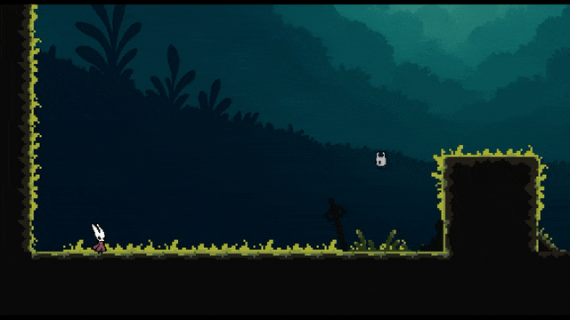

# Unfinished Business — Silksong‑inspired mini platformer (Phaser + React + Vite)

A small platformer I built to try the Phaser game engine. It’s inspired by Team Cherry's Silksong (made before the official release) and wrapped in a simple story: an inside joke turned into a surprise gift delivery for my girlfriend.

## Play / Demo

https://test-phaser-ten.vercel.app/

## Run locally
- Requirements: Node.js
- Install deps: `npm install`
- Dev server: `npm run dev` → http://localhost:8080
- Production build: `npm run build` (output in `dist/`)
- If you prefer not to send the anonymous template ping, use `npm run dev-nolog` / `npm run build-nolog`.

## Controls
- Move: Arrow keys (← →)
- Jump: Z (with coyote-time and wall jump)
- Attack: X
- Dash: Shift
- Interact (hug tree): A
- Advance dialog / skip typewriter: Space

## What’s here
- Physics platforming with coyote time, jump buffering, wall slide/jump, dash
- Simple combat vs. “bullies” with facing checks and attack cooldowns
- Parallax background and tilemap world (Tiled JSON)
- In‑game dialog (typewriter effect) including an orb companion that hints at the surprise
- A tree interaction that reveals the gift clue: “donde reinan los felinos”

## Tech stack
- Phaser 3.90
- React 19 + Vite 6 (TypeScript)
- Tilemap and sprites under `public/assets`

---

## ¿Qué es esto?
Un mini‑plataformero hecho para probar Phaser. Está inspirado en Silksong (antes de su salida oficial). La historia es un chiste interno que usé como método de entrega de un regalo sorpresa para mi novia.

## Cómo correrlo
- Requisitos: Node.js
- Instalar deps: `npm install`
- Servidor de dev: `npm run dev` → http://localhost:8080
- Build de producción: `npm run build` (sale en `dist/`)
- Si no querés mandar el ping anónimo del template, usá `npm run dev-nolog` / `npm run build-nolog`.

## Controles
- Moverse: Flechas (← →)
- Saltar: Z (tiene coyote‑time y salto en pared)
- Atacar: X
- Dash: Shift
- Interactuar (abrazar árbol): A
- Avanzar diálogo / saltear tipeo: Espacio

## Lo que trae
- Plataforma con coyote time, buffer de salto, slide y salto en pared, dash
- Combate simple contra “bullies” con dirección y cooldowns
- Fondo con parallax y mundo en tilemap (Tiled JSON)
- Diálogos con efecto máquina de escribir y un orbe compañero que te tira pistas
- Interacción con un árbol que revela la pista del regalo: “donde reinan los felinos”

## Créditos
- Hecho con Phaser + React + Vite
- Assets en `public/assets`
- Proyecto personal para jugar y aprender
